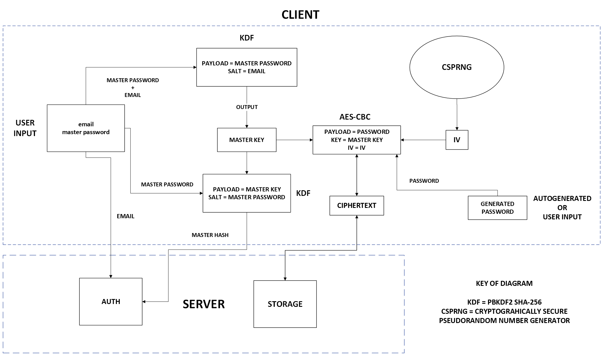

## HOW IT WORKS

## BASIC CONCEPTS

- Master password and created passwords are never stored in database
- Master password is stored as master hash(only read)
- Password are stored as password entiers encrypted with [AES-GCM](https://en.wikipedia.org/wiki/Galois/Counter_Mode)
- [AES-GCM](https://en.wikipedia.org/wiki/Galois/Counter_Mode) keys are not stored in database they are generated on client site
- Comunnication between client and server is secured by HTTPS (for educational purposes self signed cert will be used)
- Client will use [JWT](https://jwt.io/) for auth 

## REGISTER

#### Frontend

1. Entering user data (username, email) and master password
2. Generating master key for encrypting user passwords based on email as salt and master password. Suggested algorithm [PBKDF2](https://en.wikipedia.org/wiki/PBKDF2)
3. Generating master hash for authentication based on master password as salt and master key.
4. Sending Json with user data, master hash and salt

#### Backend

1. Recives Json with user data with username, email, master key and salt
2. Creates new record in database with user data
3. Returns response with status of operation

## LOGIN

#### Frontend

1. User enters email and master password 
4. Generating master key and master hash like in [register](#register) proces 
6. Sends master hash with email to server to verify
7. Recives status of auth and [JWT](https://jwt.io/)

#### Backend

1. Recives request with email
2. Checks is user exists in database
3. Verifies master hash with one in database
4. Generates [JWT](https://jwt.io/) and sends it to user with status of operation

## PASSWORD ACCESS

#### Frontend 

1. After login user sends request to server to recive all passwords entries
2. Recives all password entires
3. If user wants to access (copy/see) password client generates [AES-GCM](https://en.wikipedia.org/wiki/Galois/Counter_Mode) based on master key and IV
4. Decrypts password entire with [AES-GCM](https://en.wikipedia.org/wiki/Galois/Counter_Mode) key

#### Backend

1. Recives request from client
2. Gathers all password entires assigned to user
3. Send all password entires in response with status of operation

## NEW PASSWORD ENTIRE

#### FRONTEND

1. User inputs or generates new password 
2. [CSPNG](https://en.wikipedia.org/wiki/Cryptographically_secure_pseudorandom_number_generator) generates new IV
3. New [AES-GCM](https://en.wikipedia.org/wiki/Galois/Counter_Mode) is generated based on master key and IV
4. Encrypts new password with new [AES-GCM](https://en.wikipedia.org/wiki/Galois/Counter_Mode)
5. Sends Json with encrypted new password, iv and other data

#### BACKEND

1. Recives request from client
2. Extracts data from Json and saves it into database
3. Sends data back in response with status of operation

## CRYPTO DIAGRAM

